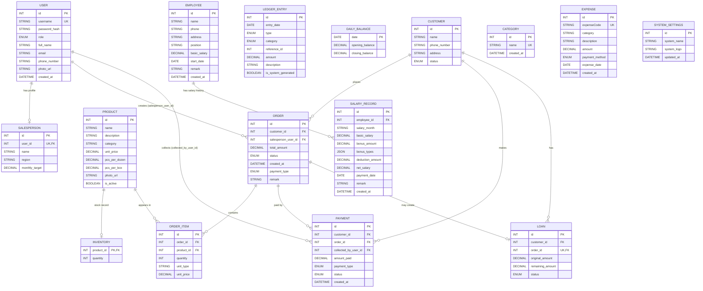

# Database Diagram (Complete)

This document describes the full database structure defined in `prisma/schema.prisma`.

## Entity-Relationship Diagram (Mermaid)

## Enum Reference

- `Role`: `ADMIN`, `SALESPERSON`
- `CustomerStatus`: `ACTIVE`, `INACTIVE`
- `OrderStatus`: `PENDING_ADMIN`, `CONFIRMED`, `CANCELLED`, `DELIVERED`
- `PaymentType`: `CASH`, `BANK`
- `PaymentStatus`: `PENDING`, `CONFIRMED`, `REJECTED`
- `LoanStatus`: `OPEN`, `CLOSED`
- `LedgerType`: `DEBIT`, `CREDIT`
- `LedgerCategory`: `SALE`, `SALARY`, `EXPENSE`, `OTHER_INCOME`

## Notes

- `LedgerEntry.reference_id` is an application-level reference (polymorphic style) and is not enforced with a DB foreign key.
- `Category` and `Expense.category` are not currently linked via a foreign key.
- `SystemSettings` is designed as a singleton row (`id = 1` default).
